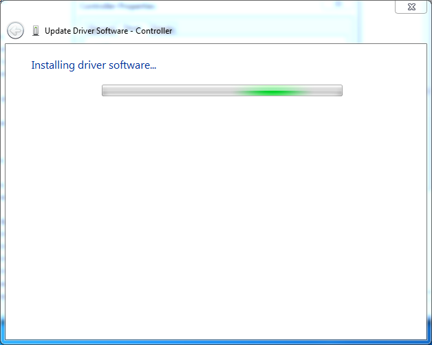

# Updated Windows 7 Xbox One Controller Driver

_By Alex Free_

This is an updated Xbox One controller driver compatible with Windows 7 that works with all existing controller models (there have been many revisions). The Xbox One controller I recently bought ('Xbox Wireless Controller Model 1914' according to the label in the battery compartment) does not work with the latest official drivers for Windows 7. This driver has added support while keeping compatibility with older Xbox One controller models.

| [Homepage](https://alex-free.github.io/updated-windows-7-xbox-one-controller-driver) | [Github](https://github.com/alex-free/updated-windows-7-xbox-one-controller-driver) |

## Table Of Contents

* [Downloads](#downloads)
* [Usage](#usage)
* [Credits](#credits)
* [License](#license)

## Downloads

### Version 1.0 (1/25/2025)

* [updated-windows-7-xbox-one-controller-driver-v1.0.zip](https://github.com/alex-free/updated-windows-7-xbox-one-controller-driver/releases/download/v1.0/updated-windows-7-xbox-one-controller-driver-v1.0.zip)

## Usage

The driver requires 2 specific Windows 7 updates to be installed, `kb2685811` and `kb2685813`. If your Windows 7 installation is not fully up to date, you can install the updates with the files included in the release of this driver. 

For x86 (32-bit), run the files `windows6.1-kb2685811-x86_4db620a8b8e85bab4822626530d01fd923c28786.msu` and `windows6.1-kb2685813-x86_d2c51b6b97d4ffcb069bcaafbff3135e96fe18e5.msu` (both are found in the `x86` folder of the release).

For x86_64 (64-bit), run the files `windows6.1-kb2685811-x64_191e09df632b70fd4f4b27d4cb9227f7c5a1c98c.msu` and `windows6.1-kb2685813-x64_22a969bada171678b0936bb320e6a7778e8adc07.msu` (both are found in the `x86_64` folder of the release).

After installing the updates, you must restart your computer before continuing below. Once the updates are finished with, connect your Xbox One controller with a USB cable to the computer and then open `Device Manager`. Right click on the `Controller` with a yellow explanation mark icon under `Other devices`.

Click `Update Driver...`.

Click `Browse my computer for driver software`

Click `Browse...` and select either the `x86` folder (if your using Windows 7 32 bit) or `x86_64` folder (if your using Windows 7 64 bit), found in the extracted release [downloaded](#downloads) previously. Then click `Next`.

Click `Install this driver anyways`. This message is displayed due to the driver being modified to work with the newer controller.

Disconnect the Xbox One controller and reconnect it. That's it! FYI, this updated driver and the official one only work via a wired USB connection on Windows 7.

## Credits

I found the resources below which helped solve this issue. The main difference is that I have only added additional support for the newer Xbox One controllers. The below guides replace support for an existing model of the controller with the new one so you loose the ability to use one of the older models of the controller with the same driver.

* [[GUIDE] How to make Xbox Series X/S controller work on Windows 7 SP1](https://www.reddit.com/r/Controller/comments/11jcqp3/guide_how_to_make_xbox_series_xs_controller_work/).
* [Is there an Xbox Series X Controller driver for Windows 7?](https://answers.microsoft.com/en-us/xbox/forum/all/is-there-an-xbox-series-x-controller-driver-for/24a3eb85-0858-4c68-9b1f-546513009c1e).

## License

This package contains official Microsoft drivers modified with publicly available information. Official Microsoft updates are also included. This package is intended to stream line and properly document the usage of newer Xbox One controller hardware with Windows 7. I do not claim any copyright for the Microsoft software and can therefore not give this any license of my own.